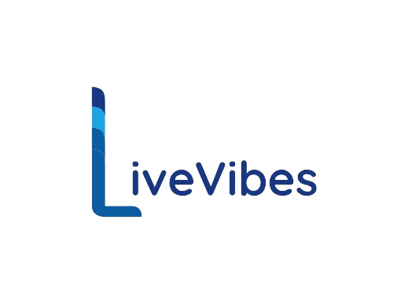
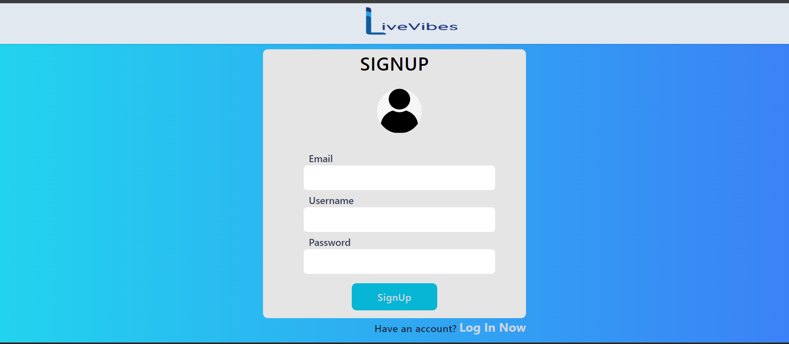

<div align="center""> </div>


LiveVibes is a live video streaming website where users can stream their webcam or screen, or both. The platform also includes a live chat feature for interactive communication.

## 🌟 Features
- Webcam Streaming
- Screen sharing
- Live chat

## 💻 Technology Used
- React
- Node.js
- Express
- MongoDB
- WebRTC
- Socket.io
- Cloudinary

## 📸 Screenshots

### 📝 Sign Up


### 🔐 Log In


### 🖥️ Dashboard


### 🎥 Streamer Page


### 🚀 Active Streams


### 👀 Viewer Page


## 💻 How to Run Locally

### 🌐 Frontend
1. Navigate to the frontend directory.
2. Create a .env file with the following content:
    ```
    VITE_SERVER_LINK=http://localhost:8000  
    # Set to the port your backend is running on
    ```
3. Install dependencies:
    ```
    npm install
    ```
4. Run the frontend:
    ```
    npm run dev
    ```

### 🌐 Backend
1. Navigate to the backend directory.
2. We are using Cloudinary service for file upload and storing images in it. To use Cloudinary, create an account there and get API key.
3. Create a .env file with the following content:
    ```
    MONGODB_URI=your_mongodb_url
    CORS_ORIGIN=http://localhost:your_frontend_port 
    # Set to your frontend localhost link
    ACCESS_TOKEN_SECRET=your_secret_key
    ACCESS_TOKEN_EXPIRY=1d 
    # Set to your preferred token expiry time
    CLOUDINARY_CLOUD_NAME=your_cloudinary_cloud_name
    CLOUDINARY_API_KEY=your_cloudinary_api_key
    CLOUDINARY_API_SECRET=your_cloudinary_api_secret
    ```
4. Install dependencies:
    ```
    npm install
    ```
5. Run the backend:
    ```
    npm start
    ```

## 📄 License
This project is licensed under the [MIT License](https://choosealicense.com/licenses/mit/) - see the [LICENSE](https://github.com/sohamhaldar/LiveVibes/blob/main/LICENSE) file for more details.
